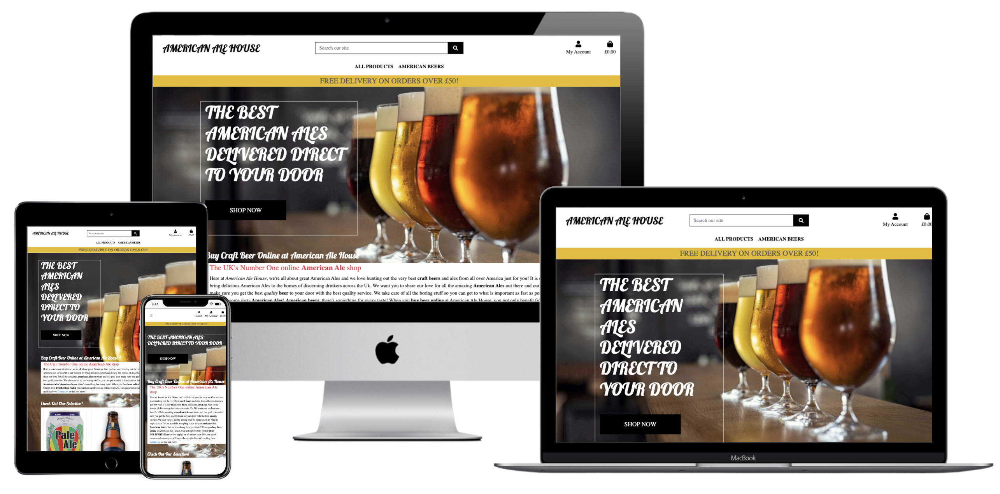

# American Ale House

The live American Ale House site can be viewed [here](https://american-ale-house.herokuapp.com/).


## Contents
+ [Aim and Description](#aim)
+ [Databases](#database)
+ [Scope](#scope)
+ [Wireframes](#wireframes)
+ [Epics and User Stories](#user-stories)
+ [Agile Methodologies](#agile)
+ [Features](#features)
+ [Marketing](#marketing)
+ [Technologies Used](#tech)
+ [Testing](#testing)
+ [Deployment](#deployment)
+ [Credits](#credits)

### Aim <a name="aim"></a>
The American Ale House is an ecommerce website allowing users to purchase American brewed beers developed for my Project 5 as part of the Code Institute - Diploma in Software Development (Full stack) Diploma.

### Description
The American Ale House websiteprovides the user the ability to purchase American brewed beers in the UK. Firstly upon landing on the site you are greeted with an elegant image which clearly protrays the purpose of the site. As a non logged in user you can browse all the products and add the ones you want into your bag ready for checkout. You can checkout by entering all your details and entering a valid credit card. Once your order is complete you will see a confirmation page and a confirmation email will be sent to your email. As a logged in user you will be able to checkout faster as your default address will be in your profile. You will also be able to view your order history and leave reviews on products that you have purchased. The logged in user will also be able to add products to their favourites for a quicker purchase next time. If you sign up to the site you will recieve a Coupon code which you will be able to redeem at checkout for a discount on your shop.

### **User registration not required**

I felt it was important the user was given the option to purchase from the site without having to register for an account. Some sites annoy me when I have to make an account to make a purchase.

If the user doesn't have an account, they are still able to make a purchase, add a delivery address and have a confirmation email sent to them when it has completed. 


## Database Design <a name="database"></a>
[Database Schema](/readme_images/database-design.png)

#### **User Account**

This app enables authenticated users to save their information so that when they are logged in the order form is pre-filled, creating an improved user experience. The `UserProfile` model has a one-to-one field that is linked to the Django AllAuth user account, upon logging in the model method `create_or_update_user_profile` creates the profile if it isn't already present in the model.

The second model in this app is `UserWishlist`, this model has two foreign keys, one relating to the `UserProfile` and the other is `Product`. This model stores the products that the user wants to be saved to their wishlist. This information is then displayed in the wishlist view.

#### **Products App**

This app controls the products that are displayed and the reviews and ratings for those products. I have created three models to store the necessary data: `Category`, `Products` & `ReviewRating`.

`Category` stores the various category types of the Ales on sale, this allows the user to filter the products by the category if they are looking for something specific.

`Products` enables individual products to be added to the database in order for them to be purchased via the online shop. Only admin users are able to access this functionality and it can be done from the front end using the `add_product` view. This model has one FK which relates to the second model in this app, the category.

`reviewRating` enables individuals to leave a review of a product so that new users can read these on the product detals page which will help them to decide to purchase or not. This model has one FK which relates to the products model in this app.

#### **Favourites**

The Favourites app is used by a logged in user to store their favourite products which will make finding them easirer the next time they visit the store. There is one model, `Favourites`.

`Favourites` contains a Fk to the product and a one to many field to the user. Once a logged in user adds a product to their favourite it will be stored on that page for them for quick reference when the come back to the store, making purchasing that bit easier and faster.

#### **Checkout**

The checkout app is used for the user to make purchases. This app contains three models, `Order`, `OrderItem` & `Coupon`. 

`OrderItem` contains all of the information regarding the products that have been purchased as part of a specific order. It has a foreign key to `Product` & `Order`, it also contains the quantity purchased of that product and then the item total. This information is used to calculate the total cost for the order. For the product FK I chose to use `on_delete=models.CASCADE`, using the 'original basket' field the admin can still see what the original purchase was.

`Order` contains all of the relevant address information for billing/shipping, a foreign key to the `UserProfile`, a foreign key to the `Coupon`, email & phone number. It also contains information regarding the payment itself, the stripe PID, original bag. Each order has an order number which is automatically generated when a new order is added to the database using `UUID`.

`update_total` calculates the overall total depending on the order items linked to the order, ensuring the value is always correct.

`Coupon` contains a coupon code and a discount value. It is a Fk of the `Order` model and if a code is added on the checkout summary page that exists in the database then the discount will be added.

## Scope <a name="scope"></a>

 * A simple, straightforward, intuitive UX experience;
 * An explicit content; 
 * An easy navigation for the user through all the features;
 * A site that is visually appealing on most devices.

### Structure

* A clear and straightforward layout is in place to ensure users can navigate intuitively and have a leisurely experience.
* Navbar is fixed on top to facilitate users easily navigating through pages. Small navigation is the same on all pages to ensure easy navigation.
* Footer is fixed on the bottom with links to social media and newsletter subscription.

### Skeleton <a name="wireframes"></a>

Wireframes created with Balsamiq. The project was developed from initial wireframes

Click to see wireframes:

[HomePage](readme_images/home-products-login-wireframes.png)<br>
[BagPage](readme_images/bag-wireframe.png)<br>
[ChaeckoutSumaryPage](readme_images/checkout-summary-wireframe.png)<br>
[ChaeckoutPage](readme_images/checkout-wireframe.png)<br>
[Favourites](readme_images/faviourites-wireframe.png)<br>
[ProfilePage](readme_images/profile-wireframe.png)<br>
[ReviewPage](readme_images/review-wireframe.png)<br>

## User Experience

### User Stories <a name="user-stories"></a>

* EPIC: American Ale House Authentication
1. As a new user I can easily register for the website so that I can purchase products quickly and easily
2. As a returning user I can log into the site with my login details so that I can access see my profile and previous orders
3. As a logged in user I can logout of the site easily so that my account is secure

* EPIC: American Ale House Product
4. As a user I can browse through all the products so that I can choose which one I want to know which one I may want to purchase
5. As a user I can select a product and view it in detail so that I can see more information that may persuade me to purchase
6. As a user I can filter the products so that so that I can view products by category and price
7. As a user I can search the site for products so that I can be directed straight to it easily saving me time scrolling through products
8. As a user I can see reviews and ratings of a product so that I can see other customer opinions on it to help me make up my mind
9. As a logged in user I can leave a product review once purchased so that I can share my experience with other customers
10. As a logged in user I can update a product review once purchased so that I can share my experience with other customers
11. As a logged in user I can delete my product review so that If I feel it is no longer relevant
12. As a Admin I can Create a new product so that I can increase the products I have for sale on the site
13. As a Admin I can Update a products details so that I can adjust the product information
14. As a Admin I can Delete a product so that I can change the products I have for sale on the site and if they are no longer available

* EPIC: American Ale House Product Purchasing
15. As a customer I can add a product to the shopping basket so that I can purchase it
16. As a customer I can adjust the quantity of items in my bag so that I can order more or less of an item
17. As a customer I can remove an item from my bag so that I am not charged for it
18. As a customer I can see the total of my basket so that I know how much I have spent
19. As a customer I can checkout securely so that I am notified the purchase has been successful


* EPIC: American Ale House User Experience
20. As a logged in user I can add or remove a product to my favourites so that it is quick and easy to purchase the item again
21. As a logged in user I can view my profile so that I can add default address and view orders
22. As a user I can receive discount codes so that I can get free delivery or money off my order
23. As a user I can see the same navigation menu on each page so that it is easy to understand and use
24. As a user I can signup to the newsletter so that I receive news and discounts from the site
25. As a user I can see the sites FAQ's so that rI may get some answers to my questions easily
26. As a user I can contact the American Ale House via phone or email so that I can make contact on any issues I might have
27. As a user I can view the sites policy so that I understand how my data will be used
28. As a user I can follow the business on social media so that I can keep up to date with latest news and offers
29. As a user I can understand the site meaning when I land on the home page so that I know I am on a site I want to purchase from
30. As a User/admin I can be notified of my actions so that I know if my actions have been successful or not
31. As a user I can view the footer on different devices so that I can still see all the content

### Agile methodology <a name="agile"></a>

* All functionality and development of this project will be managed through GitHub issues, milestones and projects.

<summary>All sprints are described here.</summary>

* Sprint 1 - 15/03/2022 - 16/03/2022 (Finished at 15/03/2022)

  + Initial setup
    - Install django
    - Install Allauth
    - Add Allauth templates to project templates
    - Create base.html
    - Create Home app
    - Create index.html, view and style
    - Create responsice navigation
    - Add to README.md file
  
* Sprint 2 - 16/03/2022 - 18/03/2022 (Finished on 17/03/2022)

  + Add Product app
    - Set up all products view
    - Set up product dteail view
  + Add bag app
    - Set up add to bag
    - Set up adjust bag
    - Set up remove from bag
  + Add Responsive footer
    - Add mailchimp form
    - Create footer layout

* Sprint 3 - 21/03/2022 - 23/03/2022 (Finished on 23/03/2022)

  + Add Checkout app
    - Set up Models
    - Set up admin
    - Set up Signals
    - Set up templates
  + Add Stripe to project
    - Set up webhooks
  + Add Product form
    - Add Create product form
    - Set up create product view
    - Set up Update Product view
    - Set up Delete Product view
  + Add FAQ's
   - Create html
   - Add questions and answers
   - Add link to footer
  + Add Contact Us
   - Create HTML
   - Set up Email functionality
   - Add link to footer

  * Sprint 4 - 24/03/2022 - 27/03/2022 (Unfinished 27/03/2022)
    + Add Profile app
    - Set up Models
    - Set up admin
    - Set up views
    - Set up templates
    + Customise allauth templates
    - Set up templates
    - Add CSS
    + Add Toasts
    - Set up notifications with toasts

  +During this iteration I ran out of time to complete the Favourites app and therefore it has been placed back in the backlog and will be prioritised for the next iteration. Probably should have factored in Mothers Day!

* Sprint 5 - 28/03/2022 - 30/03/2022 (Finished on 30/03/2022)
    + Add Favourites app
    - Set up Models
    - Set up admin
    - Set up views
    - Set up templates
    + Add Product Reviews
    - Set up Models
    - Set up admin
    - Set up views
    - Set up templates

* Sprint 6 - 31/03/2022 - 3/04/2022 (Finished on 3/04/2022)
  + Add Coupon
    - Set up Models
    - Set up views
    - Set up contexts
    - Set up templates
  + Add Facebook Business link
    - Create FB busness page
    - Add link in footer (not to deployed site but will be once deployed)
  + Add site policy
    - Generated a site policy with a generator site
    - Added link to the Footer
  + Add Subscription (mailchimp)
    - Form already in place for mailchimp
    - Created mailchimp account (Site is not deployed at this point)
    - Moved css to custom file
    - Moved js to bottom of base.html

* The final part of this project such as testing and Fixing bugs was done as and when I could get time around my job and kids.

## Business Model

+ A traditional B2C (Business to Customer) application has been chosen, with a straightforward and user-friendly responsive interface.

+ This online store offers American Ale products to the final customer.

## Marketing <a name="marketing"></a>

+ This site has a Facebook Business Page with a link on the page footer. It can be viewed here:
[American Ale House Facebook Page](https://www.facebook.com/AmericanAleHouseUK/)
[American Ale House Facebook Page Images](/readme_images/facebook-img-1.png)
[American Ale House Facebook Page Images](/readme_images/facebook-img-2.png)

+ Users can subscribe to our newsletter to receive all offers in their email box. Subscription links are available on the footer on all pages. 

+ Upon registering, the user is redirected to a new page confirming their subscription. The site owner can now see the new subscriber on their audience dashboard, and new campaigns will be sent to them too.

+ Once a user has signed up they will receive a discount code to apply at checkout.

+ I have searched similar websites and google gor good key words to apply to the site for SEO purposes:

- Beer
- Ale
- Larger
- Draught
- American Ale

- THE BEST AMERICAN ALES DELIVERED DIRECT TO YOUR DOOR

- I have used the meta description and keywords to improve the SEO

* There are no sponsored or paid links on this site.

### Surface

* Colours

The Colour scheme was generated using the eyedropper plugin to get one colour from the logo image and [colours](https://coolors.co/) to create the colour palette.

[View Pallet Here](https://coolors.co/palette/9d3904-af0707-684c34-221e1f-c9b088-e6bb1a-ffffff)

* Font Selection
 
Two complimentary fonts were chosen with [Google Fonts](https://fonts.google.com/) to be used across the website.

The chosen fonts were Lobster for headings and navbar and Open Sans for lists, buttons and paragraphs.

## Features <a name="features"></a>

### Features planned
* Responsive design.
* Website title and information on the site purpose.
* Navigation Menu (Site Wide).
* Postgress databases to store information and user login/profile information.
* CRUD Functionality
* Login functionality.
* Logout functionality.
* Ability to view all products.
* Ability to view product details.
* Ability to add and remove product to a favourites.
* Ability to add and remove product to the bag to purchase.
* Ability to Update quantity of or remove items in bag.
* Ability to Apply a Coupon to the order.
* Ability to review a product.
* Ability to sign up to a newsletter.
* Ability to view a site policy.
* Ability to view FAQ's.
* Ability to contact the site owners.
* Ability to checkout and receive confirmation of purchase.
* Admin creation and management of products.

**Importance and Difficulty**

|       Feature         |   Difficulty   |   Importance   |
|:--------------------  |--------------- |--------------- |
|Postgress databases to |       5        |       5        |
|store information and  |                |                |
|user login/profile     |                |                |
|information            |                |                |
|:--------------------  |--------------- |--------------- |
|CRUD Functionality     |       5        |       5        |
|:--------------------  |--------------- |--------------- |
|Admin creation and     |       5        |       5        |
|management of Products |                |                |
|:--------------------  |--------------- |--------------- |
|Ability to view all    |       2        |       5        |
|products.              |                |                |
|:--------------------  |--------------- |--------------- |
|Ability to view        |       2        |       5        |
|product details        |                |                |
|:--------------------  |--------------- |--------------- |
|Ability to add and     |       2        |       5        |
|remove a product from  |                |                |
|favourites.            |                |                |
|:--------------------  |--------------- |--------------- |
|Ability to add and     |       2        |       5        |
|remove a product from  |                |                |
|the bag to purchase.   |                |                |
|:--------------------  |--------------- |--------------- |
|Ability to update the  |       3        |       5        |
|quantity or remove a   |                |                |
|product from the bag.  |                |                |
|:--------------------  |--------------- |--------------- |
|Ability to add a       |       5        |       5        |
|coupon to the order.   |                |                |
|:--------------------  |--------------- |--------------- |
|Registered user can    |       5        |       5        |
|review a product.      |                |                |
|:--------------------  |--------------- |--------------- |
|Ability to signup to   |       2        |       5        |
|a newsletter.          |                |                |
|:--------------------  |--------------- |--------------- |
|Ability to view a site |       2        |       5        |
|policy.                |                |                |
|:--------------------  |--------------- |--------------- |
|Ability to view a site |       2        |       5        |
|FAQ's.                 |                |                |
|:--------------------  |--------------- |--------------- |
|Ability to contact the |       2        |       5        |
|site owners.           |                |                |
|:--------------------  |--------------- |--------------- |
|Ability to checkout and|       2        |       5        |
|receive confirmation   |                |                |
|of purchase.           |                |                |
|:--------------------  |--------------- |--------------- |
|Login functionality    |       3        |       5        |
|:--------------------  |--------------- |--------------- |
|Navigation Menu        |       3        |       5        |
|(Site Wide)            |                |                |
|:--------------------  |--------------- |--------------- |
|Responsive design      |       2        |       5        |
|:--------------------  |--------------- |--------------- |
|Website title and      |       1        |       5        |
|information on the     |                |                |
|the site purpose       |                |                |
|:--------------------  |--------------- |--------------- |
|Logout functionality   |       1        |       5        |


### Existing Features
* Website title and information on the site purpose.
* Navigation Menu (Site Wide).
* Postgress databases to store information and user login/profile information.
* CRUD Functionality
* Login functionality.
* Logout functionality.
* Ability to view all products.
* Ability to view product details.
* Ability to add and remove product to a favourites.
* Ability to add and remove product to the bag to purchase.
* Ability to Update quantity of or remove items in bag.
* Ability to Apply a Coupon to the order.
* Ability to review a product.
* Ability to sign up to a newsletter.
* Ability to view a site policy.
* Ability to view FAQ's.
* Ability to contact the site owners.
* Ability to checkout and receive confirmation of purchase.
* Admin creation and management of products.


### Future Features
* Implementation of a site blog.
* Allow for admin to create discound codes and manage on site.
* Allow for the creation of different categories on site.

## Technologies Used <a name="tech"></a>

* [HTML](https://en.wikipedia.org/wiki/HTML)
	* This project uses HTML as the main language used to complete the structure of the Website.
* [CSS](https://en.wikipedia.org/wiki/CSS)
	* This project uses custom written CSS to style the Website.
* [JavaScript](https://en.wikipedia.org/wiki/JavaScript)
    * JavaScript is used for the google map on the contact page [mapsjs](https://developers.google.com/maps)
    * [jQuery](https://jquery.com/) is used for the following: 
        * Mobile side nav
        * Displaying Success/Fail message verifying contact form status.
        * To populate downdrops on select elements.
* [Python](https://www.python.org/)
    * This projects core was created using Python, the back-end logic and the means to run/view the Website.
    * Python Modules used (These can be found in the requirements.txt project file):
        * asgiref==3.4.1
        * cloudinary==1.28.0
        * dj-database-url==0.5.0
        * dj3-cloudinary-storage==0.0.6
        * Django==3.2.9
        * django-allauth==0.46.0
        * gunicorn==20.1.0
        * oauthlib==3.1.1
        * psycopg2==2.9.2
        * PyJWT==2.3.0
        * python3-openid==3.2.0
        * pytz==2021.3
        * requests-oauthlib==1.3.0
        * sqlparse==0.4.2
* [Django](https://en.wikipedia.org/wiki/Django_(web_framework))
    * This project was created using the Django framework, the back-end logic and the means to run/view the Website.
* [Bootstrap](https://getbootstrap.com/)
    * The Bootstrap framework was used through the website for layout and responsiveness.
* [Google Fonts](https://fonts.google.com/)
	* Google fonts are used in the project to import the fonts for the site.
* [GitHub](https://github.com/)
	* GithHub is the hosting site used to store the source code for the Website.
* [Gitpod](https://gitpod.io/)
	* Gitpod is used as version control software to commit and push code to the GitHub repository where the source code is stored.
* [AWS S3 Buckets](https://aws.amazon.com/s3/)
	* AWS S3 Buckets provides the storage for the deployed sites static and Media files.
* [Heroku](https://dashboard.heroku.com/apps)
    * Heroku was used to deploy the live website.
* [Google Chrome Developer Tools](https://developers.google.com/web/tools/chrome-devtools)
	* Google chromes built in developer tools are used to inspect page elements and help debug issues with the site layout and test different CSS styles.
* [balsamiq Wireframes](https://balsamiq.com/wireframes/)
	* This was used to create wireframes for 'The Skeleton Plane' stage of UX design.
* [Font Awesome](https://fontawesome.com/)
    * All the Icons displayed throughout the website are Font Awesome icons.
* [Favicon](https://favicon.io/)
    * Favicon.io was used to make the site favicon 
* [Am I Responsive](http://ami.responsivedesign.is/#)
    * Multi Device Website Mockup Generator was used to create the Mock up image in this README

## Testing <a name="testing"></a>

Testing is required on all features and user stories documented in the TESTING.md file linked from this README below as the testing is a large section. 
All clickable links must redirect to the correct pages. All forms linked to the database
must be tested to ensure they insert all given fields into the correct collections.

HTML Code must pass through the [W3C HTML Validator](https://validator.w3.org/#validate_by_uri).

CSS Code must pass through the [W3C CSS Validator](https://jigsaw.w3.org/css-validator/).

JavaScript code must pass through the [JSHint Validator](https://jshint.com/).

Python Code must pass through [PEP8 Validator](http://pep8online.com/)

The website was extensively tested as it was developed using:
* print().
* The terminal by printing the expected outcome.
* Testing User Stories.
* Testing scenarios manually.
* Testing functionallity manually.
* Automated Testing

This project has been tested throughout its inception. Each input has been thoroughly tested to make sure that any invalid inputs are handled correctly and a response is shown to the user.

Full test results can be found [here](TESTING.md)

## Deployment on Heroku <a name="deployment"></a>

This project was deployed through Heroku using the following steps:

### Requirements and Procfile
Heroku needs to know which technologies are being used and any requirements, so I created files to let it know. Before creating the Heroku app, create these files using the following steps in GitPod: 
* In the GitPod terminal, type ```pip3 freeze --local > requirements.txt``` to create your requirements file.
* Create your Procfile and insert the following code: ```web: gunicorn american_ale_house.wsgi``` and make sure there is no additional blank line after it. 
* Push these files to your repository.

### Creating Heroku App
* Log into Heroku
* Select 'Create New App' from your dashboard
* Choose an app name (if there has been an app made with that name, you will be informed and will need to choose an alternative)
* Select the appropriate region based on your location
* Click 'Create App'

### Connecting to GitHub
* From the dashboard, click the 'Deploy' tab towards the top of the screen
* From here, locate 'Deployment Method' and choose 'GitHub'
* From the search bar newly appeared, locate your repository by name
* When you have located the correct repository, click 'Connect'
* DO NOT CLICK 'ENABLE AUTOMATIC DEPLOYMENT': This can cause unexpected errors before configuration. We'll come back to this.

### Environment Variables
* Click the 'Settings' tab towards the top of the page
* Locate the 'Config Vars' and click 'Reveal Config Vars'
* Enter all variables needed:
SECRET_KEY - `<Random key generated online or manually>`
DATABASE_URL - `<Postgres generated>`
USE_AWS: `True`
AWS_ACCESS_KEY_ID: `<your AWS access key id, generated in the AWS console after user creation>`
AWS_SECRET_ACCESS_KEY: `<your secret AWS access key, generated in the AWS console after user creation>`
STRIPE_PUBLIC_KEY: `<your Stripe public key from the Stripe dashboard>`
STRIPE_SECRET_KEY: `<your Stripe secret key from the Stripe dashboard>`
STRIPE_WEBHOOK_KEY: `<your Stripe webhook key.>`
EMAIL_ADDRESS - `<Site's email address>` 
EMAIL_PASSWORD - `<Password from email client>`

### Heroku Postgres Database
* AWS S3 Buckets
* Paste variable in to Heroku config vars.

### Heroku Postgres Database
* Go to the resources tab in Heroku.
* In the Add-ons search bar look for Heroku Postgres & select it.
* Choose the Hobby Dev-Free option in plans.
* Click submit order form.
* Go back to the build environment and install 2 more requirements:
  * ```pip3 install dj_databse_url```
  * ```pip3 install psycopg2-binary```
  make sure to add these to the requirements file using ```pip3 freeze > requirements.txt``` 

## Set up Emails

## I used Gmail for the email on the contact page. Others can be used but will need a few changes**

* Go to settings.py and change the EMAIL_HOST_USER to your chosen email address.
* If you want to set up a new Gmail account for the site, this is the time to do so.
* Go to the Gmail account and open the 'Settings' tab.
* Go to 'Accounts and Imports' > 'Other Google Account Settings'.
* Go to the 'Security' tab and open 'Signing in to Google'.
* Click on '2-step Verification', click 'Get Started' and turn on 2-step verification following their instructions.
* Go to 'Security' > 'Signing in to Google' > 'App Passwords'.
* (You may have to input your account password again) Set 'App' to 'Mail', 'Device' to Other, and name it Django.
* The passcode that appears will be used in your Heroku variables.

## Deploy
* In Heroku, once all the variables are in place, locate 'Manual Deploy' > choose the master branch and click 'Deploy Branch'.
* Once the app is built (it may take a few minutes), click 'Open App' from the top of the page.
* Go back to the 'Deploy' tab and you can now click 'Enable Automatic Deployment'. Changes automatically deploy when you make a git push.

## Forking the Repository
* Log in to GitHub and locate the GitHub Repository.
* At the top of the Repository above the "Settings" Button on the menu, locate the "Fork" Button.
* You will have a copy of the original repository in your GitHub account.
* You will now be able to make changes to the new version and keep the original safe. 

## Making a Local Clone
* Log into GitHub.
* Locate the repository.
* Click the 'Code' dropdown above the file list.
* Copy the URL for the repository.
* Open Git Bash on your device.
* Change the current working directory to the location where you want the cloned directory.
* Type ```git clone``` in the CLI and then paste the URL you copied earlier. This is what it should look like:
  * ```$ git clone https://github.com/Steven-Dawson18/american-ale-house```
* Press Enter to create your local clone.

You will need to install all of the packages listed in the requirements file you can use the following command in the terminal ```pip install -r requirements.txt``` which will do it for you. 

## Credits <a name="credits"></a>

### Code
* The project is based on the Boutique Ado project by the Code Institute and was used as a basse for my project (https://github.com/Code-Institute-Solutions/boutique_ado_v1/)
* I used  this post on stackoverflow to redirect to the previous page for updating a review of a product. This code is comented in the view code. https://stackoverflow.com/questions/62626660/redirect-back-to-previous-page-django
* I used a tutorial to get the stars working for the review rating. I found this on Udemy Django Ecommerce course - https://www.udemy.com/course/django-ecommerce-project-based-course-python-django-web-development

### Media
* Images - Some images used are taken from google images. Other product images were taken from https://denverbeerco.com/.

### Acknowledgments
My mentor Antoino Rodriguez for his advice and guidance.
Code Institutes Tutor support for their help and guidance.
My Sister In Law Krista Dawson for her support and guidance.
