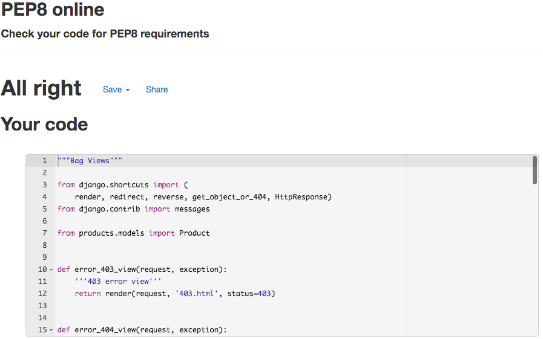

# Full Testing
## Contents
+ [Validator Testing](#validator-testing)
+ [Lighthouse Testing](#lighthouse-testing)
+ [Testing From User Stories](#testing-from-user-stories)
+ [Testing Automated Tests](#testing-automated-tests)
+ [Manually Testing Functionality](#manually-testing-functionality)
+ [Responsive Testing](#responsive-testing)
+ [Bugs and Fixes](#bugs-and-fixes)
+ [Known Bugs](#known-bugs)
+ [Credentials](#kcredentials)

---
---

## Validator Results 

### HTML Results:
#### Home
* Home Page
 
* Sign up Page
 
* Sign in Page
 
* sign out Page
 
* Contact Page
 
* Frequently Asked Questions Page
 
#### Products
* Products Page
 
* Product Details Page
 
* Update Product Review Page
 
* Delete Product Review Page
 
#### Favourites
* Favourites Page
 
#### Bag
* Bag Page
 
#### Checkout
* Checkout Summary Page
 
* Checkout Page
 
* Checkout Success Page
 
#### Profiles
* Profiles Page
* Could not verify this page as it containes private information 
Some of the validator tests show a warning. This warning read - The type attribute is unnecessary for JavaScript resources. I have decided to ignore these warnings as they do not harm the site.
### CSS Results:
 

### JavaScript Results:
 
 
 
 
 
* Some JSHint validation results show an unused vairable "$" this is because I was using JQuery. These also were taken from the Boutique Ado material and so I did not alter.

### Python Results:
#### Home App
 
 
 
#### Bag App
 
 
 
 
#### Checkout App
 
 
 
 
 
 
 
 
 
 
#### Favourites App
 
 
 
 
 
#### Products App
 
 
 
 
 
 
 
#### Profiles App
 
 
 
 
 
 

---
---

## Lighthouse Testing 

After getting the bulk of the site in place, I ran it through Chrome Lighthouse.

---
---

### Testing User Stories 

22. As a user I can receive discount codes so that I can get free delivery or money off my order
23. As a user I can see the same navigation menu on each page so that it is easy to understand and use
24. As a user I can signup to the newsletter so that I receive news and discounts from the site
25. As a user I can see the sites FAQ's so that rI may get some answers to my questions easily
26. As a user I can contact the American Ale House via phone or email so that I can make contact on any issues I might have
27. As a user I can view the sites policy so that I understand how my data will be used
28. As a user I can follow the business on social media so that I can keep up to date with latest news and offers
30. As a user I can understand the site meaning when I land on the home page so that I know I am on a site I want to purchase from

1. As a new user I can easily register for the website so that I can purchase products quickly and easily.

* When the user navigates to the register button in the navigation bar they are directed to the register page. Filling in the form is quick and easy. Once filled out the user is displayed a message to say they have been sent a confirmation email. The new user will need to click the link in that email inorder to complete the signup. Once the email is confirmed the user will then enter their login details and be redirected to the home page.
* This has been tested manually to ensure it works as it should.

2. As a returning user I can log into the site with my login details so that I can access see my profile and previous orders.

* If the user is a returning user they will be able Log in easily and view their past orders in the profile tab in the navigation, if they have made any orders.
* This has been tested manually to ensure it works as it should.

3. As a logged in user I can logout of the site easily so that my account is secure

* A logged in user can select to log out of their account so that their information is secure.
* This has been tested manually to ensure it works as it should.

4. As a user I can browse through all the products so that I can choose which one I want to know which one I may want to purchase.

* By clicking the All Products button the user can select different ways to view the products. By selecting All Products again the user will be shown all the products on one page with simple information about each one..
* This has been tested manually to ensure it works as it should.

5. As a user I can select a product and view it in detail so that I can see more information that may persuade me to purchase.

* The user can select any product to view the product in detail. On this page the user is able to increase/ decrease the quantity and add the product to their basket. They will also be able to see if the product has any rating or reviews and add it to their favourites.
* This has been tested manually to ensure it works as it should.

6. As a user I can filter the products so that so that I can view products by category and price

* The user is able to filter the products by category, price andrating by selecting the appropriate tab in the sort box in the top right corner of the products window.
* This has been tested manually to ensure it works as it should.

7. As a user I can search the site for products so that I can be directed straight to it easily saving me time scrolling through products

* The user is able to enter words in the search bar to quickly search for a product.
* This has been tested manually to ensure it works as it should.

8. As a user I can see reviews and ratings of a product so that I can see other customer opinions on it to help me make up my mind

* On the product details page a user is able to see any reviews left by other users. This will help customers decisions a little easier to make.
* This has been tested manually to ensure it works as it should.

9. As a logged in user I can leave a product review once purchased so that I can share my experience with other customers

* As a logged in user I can leave a review and rating of a product on the product details page. Once reviewed I can update/delete my review if I wanted to.
* This has been tested manually to ensure it works as it should.

10. As a logged in user I can update a product review once purchased so that I can share my experience with other customers.

* As a logged in user, if I have left a review of a product I can update the review by clicking the update button on the review.
* This has been tested manually to ensure it works as it should.

11. As a logged in user I can delete my product review so that If I feel it is no longer relevant

* As a logged in user, if I have left a review of a product I can delete the review by clicking the delete button on the review.
* This has been tested manually to ensure it works as it should.

12. As a Admin I can Create a new product so that I can increase the products I have for sale on the site

* The admin, once logged in can add a new product by selecting the product management tab in the nav bar.
* This has been tested manually to ensure it works as it should.

13. As a Admin I can Update a products details so that I can adjust the product information

* The admin, once logged in can edit a product by selecting the edit button on the product details page. Once this is clicked they are taken to a form to edit the product details.
* This has been tested manually to ensure it works as it should.

14. As a Admin I can Delete a product so that I can change the products I have for sale on the site and if they are no longer available.

* The admin is able to delete a product by selecting the delete button on the products or product detail page.
* This has been tested manually to ensure it works as it should.

15. As a customer I can add a product to the shopping basket so that I can purchase it.

* A customer can add a product to their bag either as a logged in user or as a non logged in user by selecting the quantity and clicking the add to bag button.
* This has been tested manually to ensure it works as it should.

16. As a customer I can adjust the quantity of items in my bag so that I can order more or less of an item

* A customer can add a product to their bag either as a logged in user or as a non logged in user by selecting the quantity by clicking the pluss or minus buttons or entering a number and clicking the add to bag button.
* This has been tested manually to ensure it works as it should.

17. As a customer I can remove an item from my bag so that I am not charged for it

* A customer can rermove a product to their bag either as a logged in user or as a non logged in user by selecting the remove button for the product on the bag page.
* This has been tested manually to ensure it works as it should.

18. As a customer I can see the total of my basket so that I know how much I have spent

* As a customer I can see the total cost of items in my basket from any page on the site. This is visible in the nav bar at the top right of the screen.
* This has been tested manually to ensure it works as it should.

19. As a customer I can checkout securely so that I am notified the purchase has been successful

* As a customer I can checkout securely and am notified with a success message and confirmation email that the purchase has been successful
* This has been tested manually to ensure it works as it should.

20. As a logged in user I can add or remove a product to my favourites so that it is quick and easy to purchase the item again

21. As a logged in user I can view my profile so that I can add default address and view orders

* As a logged in user I can add a product to my favourites and remove them by clicking the heart on the product details page. If the user is not logged in they will be asked to log in first. You can also remove the product from the favourites page.
* This has been tested manually to ensure it works as it should.

22. As a user I can receive discount codes so that I can get free delivery or money off my order

* As a logged in user I can add or update default delivery information that will make the checkout process faster.
* This has been tested manually to ensure it works as it should.

* As a logged in user I can add or update default delivery information that will make the checkout process faster.
* This has been tested manually to ensure it works as it should.

28. As a user I can follow the business on social media so that I can keep up to date with latest news and offers

* The user is able to view the sites social networks by clicking on the icons at the bottom of the page in the footer, this will help keep them uptodate with any offers or news the cafe has. These links will open in a new tab.
* This has been tested manually to ensure it works as it should.

---
---
