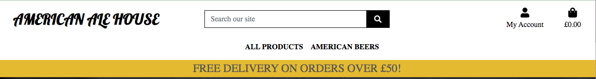
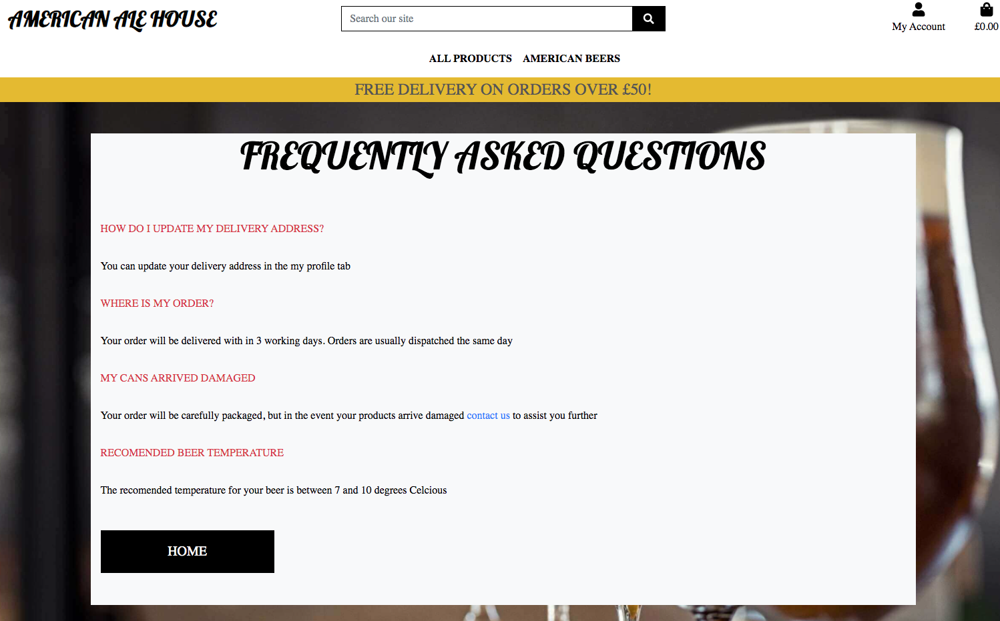

# Full Testing
## Contents
+ [Validator Testing](#validator-testing)
+ [Lighthouse Testing](#lighthouse-testing)
+ [Testing From User Stories](#testing-from-user-stories)
+ [Testing Automated Tests](#testing-automated-tests)
+ [Manually Testing Functionality](#manually-testing-functionality)
+ [Responsive Testing](#responsive-testing)
+ [Bugs and Fixes](#bugs-and-fixes)
+ [Known Bugs](#known-bugs)
+ [Credentials](#kcredentials)

---
---

## Validator Results 

### HTML Results:
#### Home
* Home Page
 
* Sign up Page
 
* Sign in Page
 
* sign out Page
 
* Contact Page
 
* Frequently Asked Questions Page
 
#### Products
* Products Page
 
* Product Details Page
 
* Update Product Review Page
 
* Delete Product Review Page
 
#### Favourites
* Favourites Page
 
#### Bag
* Bag Page
 
#### Checkout
* Checkout Summary Page
 
* Checkout Page
 
* Checkout Success Page
 
#### Profiles
* Profiles Page
* Could not verify this page as it containes private information 
Some of the validator tests show a warning. This warning read - The type attribute is unnecessary for JavaScript resources. I have decided to ignore these warnings as they do not harm the site.
### CSS Results:
 

### JavaScript Results:
 
 
 
 
 
* Some JSHint validation results show an unused vairable "$" this is because I was using JQuery. These also were taken from the Boutique Ado material and so I did not alter.

### Python Results:
#### Home App
 
 
 
#### Bag App
 
 
 
 
#### Checkout App
 
 
 
 
 
 
 
 
 
 
#### Favourites App
 
 
 
 
 
#### Products App
 
 
 
 
 
 
 
#### Profiles App
 
 
 
 
 
 

---
---

## Lighthouse Testing 

After getting the bulk of the site in place, I ran it through Chrome Lighthouse.

---
---

### Testing User Stories 

1. As a new user I can easily register for the website so that I can purchase products quickly and easily.

* When the user navigates to the register button in the navigation bar they are directed to the register page. Filling in the form is quick and easy. Once filled out the user is displayed a message to say they have been sent a confirmation email. The new user will need to click the link in that email inorder to complete the signup. Once the email is confirmed the user will then enter their login details and be redirected to the home page.
* This has been tested manually to ensure it works as it should.

2. As a returning user I can log into the site with my login details so that I can access see my profile and previous orders.

* If the user is a returning user they will be able Log in easily and view their past orders in the profile tab in the navigation, if they have made any orders.
* This has been tested manually to ensure it works as it should.

3. As a logged in user I can logout of the site easily so that my account is secure

* A logged in user can select to log out of their account so that their information is secure.
* This has been tested manually to ensure it works as it should.

4. As a user I can browse through all the products so that I can choose which one I want to know which one I may want to purchase.

* By clicking the All Products button the user can select different ways to view the products. By selecting All Products again the user will be shown all the products on one page with simple information about each one..
* This has been tested manually to ensure it works as it should.

5. As a user I can select a product and view it in detail so that I can see more information that may persuade me to purchase.

* The user can select any product to view the product in detail. On this page the user is able to increase/ decrease the quantity and add the product to their basket. They will also be able to see if the product has any rating or reviews and add it to their favourites.
* This has been tested manually to ensure it works as it should.

6. As a user I can filter the products so that so that I can view products by category and price

* The user is able to filter the products by category, price andrating by selecting the appropriate tab in the sort box in the top right corner of the products window.
* This has been tested manually to ensure it works as it should.

7. As a user I can search the site for products so that I can be directed straight to it easily saving me time scrolling through products

* The user is able to enter words in the search bar to quickly search for a product.
* This has been tested manually to ensure it works as it should.

8. As a user I can see reviews and ratings of a product so that I can see other customer opinions on it to help me make up my mind

* On the product details page a user is able to see any reviews left by other users. This will help customers decisions a little easier to make.
* This has been tested manually to ensure it works as it should.

9. As a logged in user I can leave a product review once purchased so that I can share my experience with other customers

* As a logged in user I can leave a review and rating of a product on the product details page. Once reviewed I can update/delete my review if I wanted to.
* This has been tested manually to ensure it works as it should.

10. As a logged in user I can update a product review once purchased so that I can share my experience with other customers.

* As a logged in user, if I have left a review of a product I can update the review by clicking the update button on the review.
* This has been tested manually to ensure it works as it should.

11. As a logged in user I can delete my product review so that If I feel it is no longer relevant

* As a logged in user, if I have left a review of a product I can delete the review by clicking the delete button on the review.
* This has been tested manually to ensure it works as it should.

12. As a Admin I can Create a new product so that I can increase the products I have for sale on the site

* The admin, once logged in can add a new product by selecting the product management tab in the nav bar.
* This has been tested manually to ensure it works as it should.

13. As a Admin I can Update a products details so that I can adjust the product information

* The admin, once logged in can edit a product by selecting the edit button on the product details page. Once this is clicked they are taken to a form to edit the product details.
* This has been tested manually to ensure it works as it should.

14. As a Admin I can Delete a product so that I can change the products I have for sale on the site and if they are no longer available.

* The admin is able to delete a product by selecting the delete button on the products or product detail page.
* This has been tested manually to ensure it works as it should.

15. As a customer I can add a product to the shopping basket so that I can purchase it.

* A customer can add a product to their bag either as a logged in user or as a non logged in user by selecting the quantity and clicking the add to bag button.
* This has been tested manually to ensure it works as it should.

16. As a customer I can adjust the quantity of items in my bag so that I can order more or less of an item

* A customer can add a product to their bag either as a logged in user or as a non logged in user by selecting the quantity by clicking the pluss or minus buttons or entering a number and clicking the add to bag button.
* This has been tested manually to ensure it works as it should.

17. As a customer I can remove an item from my bag so that I am not charged for it

* A customer can rermove a product to their bag either as a logged in user or as a non logged in user by selecting the remove button for the product on the bag page.
* This has been tested manually to ensure it works as it should.

18. As a customer I can see the total of my basket so that I know how much I have spent

* As a customer I can see the total cost of items in my basket from any page on the site. This is visible in the nav bar at the top right of the screen.
* This has been tested manually to ensure it works as it should.

19. As a customer I can checkout securely so that I am notified the purchase has been successful

* As a customer I can checkout securely and am notified with a success message and confirmation email that the purchase has been successful
* This has been tested manually to ensure it works as it should.

20. As a logged in user I can add or remove a product to my favourites so that it is quick and easy to purchase the item again

* As a logged in user I can add a product to my favourites and remove them by clicking the heart on the product details page. If the user is not logged in they will be asked to log in first. You can also remove the product from the favourites page.
* This has been tested manually to ensure it works as it should.

21. As a logged in user I can view my profile so that I can add default address and view orders

* As a logged in user I can add or update default delivery information that will make the checkout process faster.
* This has been tested manually to ensure it works as it should.

22. As a user I can receive discount codes so that I can get free delivery or money off my order

* Once signed up for the site the user will receive a code FIRST_TIMER that can be added ar checkout for £5 off their order. Codes will also be able to be sent out in marketing emails.
* This has been tested manually to ensure it works as it should.

23. As a user I can see the same navigation menu on each page so that it is easy to understand and use

* The navigation for the site is the same on every page so that it is easy for the user to navigate around
* This has been tested manually to ensure it works as it should.

24. As a user I can signup to the newsletter so that I receive news and discounts from the site

* By entering an email address into the Hop on Board section in the footer a user can sign up to receive the newsletter and get all the news, special offers and discount codes.
* This has been tested manually to ensure it works as it should.

25. As a user I can see the sites FAQ's so that I may get some answers to my questions easily

* In the footer on every page there is a link to the frequently asked questions page where the user can get answeres to common questions. If there is no answer for their question they are provided with a link to contact us.
* This has been tested manually to ensure it works as it should.

26. As a user I can contact the American Ale House via phone or email so that I can make contact on any issues I might have

* In the footer on every page there is a link to the contact us page. On the page the user will find an address and phone number and email address as well as a geet in touch form that they can fill out to send a direct message to the site owners.
* This has been tested manually to ensure it works as it should.

27. As a user I can view the sites policy so that I understand how my data will be used

* In the footer on every page there is a link to the Site policy. This opens in a separate tab in their browser.
* This has been tested manually to ensure it works as it should.

28. As a user I can follow the business on social media so that I can keep up to date with latest news and offers

* The user is able to view the sites social networks by clicking on the icons at the bottom of the newsletter signup in the footer, this will help keep them up to date with any offers or news the American Ale House has. These links will open in a new tab. The Facebookpage has been created for the American Ale House and links to the page.
* This has been tested manually to ensure it works as it should.

29. As a user I can understand the site meaning when I land on the home page so that I know I am on a site I want to purchase from

* It is obvious what the site is about as soon as a new user lands on the site. There is a background image that is linked to the sites purpose of Beer and the site name is very descriptive. The main tesx on the home page also clearly states what the site is about.
* This has been tested manually to ensure it works as it should.

30. As a User/admin I can be notified of my actions so that I know if my actions have been successful or not

* Users are notified with messages so they know if they have been successful or not, For example if the user is adding a product to their bag , as in the picture above, they will get a success message.
* This has been tested manually to ensure it works as it should.

31. As a user I can view the footer on different devices so that I can still see all the content

* The footer is responsive to the size of the devise it is being viewed on. Customer services, contact us and opening hours are side by side  and stack on smaller devices.
* This has been tested manually to ensure it works as it should.

---
---
## Automated Testing 

Automated Unit Testing was carried out with Djangos testing tools and written to cover as much of the site as possible. Below is an overview of each app and what was tested:

### Home App

+ Views
   + test that the home view works
   + test that the contact view works
   + test that the email sends in contact view
   + test that faq view works

### Bag App

+ Views
   + Test that all users can view the bag page
   + Test that all users can add a product to the bag
   + Test that all users can update a product on the bag
   + Test that all users can remove a product from the bag
  

### Checkout App

+ Models
   + Test the order number string
   + Test the Coupon code

+ Views
   + Test that the user gets an error message if they try to checkout with an empty bag

+ Forms
   + Test the form does not submit without full_name field
   + Test the form does not submit without email field
   + Test the form does not submit without phone_number
   + Test the form does not submit without country field
   + Test the form does not submit without town_or_city field
   + Test the form does not submit without street_address field
   
### Favourites App

+ Models
   + Test tests the favourites str method

+ Views
   + Tests the user can view their favourites page
   + Test for adding a product to favourites
   + Test remove a product from the users favourites

### Products App

+ Models
   + Test model returns Category name and friendly name as a string
   + Test model returns Product name as a string

+ Views
   + Check users are set up
   + Test URL response success
   + Test users can view all products
   + Test users can view the Product details page
   + Test superuser can access the add a product page
   + Test non superuser can't access the add a product page
   + Test a superuser can delete a product
   + Test a non superuser can't delete a product
   + Test a logged in user can add a review to a product
   + Test a logged in user can update a review on a product
   + Test a logged in user can delete a review on a product

### Profiles App

+ Models
   + tests the users profile username returned as a string

+ Views
   + Test logged in user can access their profile page
   + Test using correct template in profile page
   + Test user can see their order history
   + Test that default delivery info updates

---
---

## Manually Testing Functionality 
### **Navigation**

|Element               |Action|Expected Result               |Pass/Fail|
|:-------------         |:----|:----------------------------------|:---|
| **NavBar**            |                                         |    |
|Site Name              |Click|Redirect to home                   |Pass|
|My profile Dropdown    |Click|Open profile dropdown              |Pass|
|Register Link          |Click|Redirect to register page          |Pass|
|                       |     |(Not visible if user logged in)    |Pass|
|Log In Link            |Click|Redirect to log in page            |Pass|
|                       |     |(Not visible if user logged in)    |Pass|
|Product Management Link|Click|Redirect to add_product page       |Pass|
|                       |     |(Only visble if admin logged in)   |Pass|
|My Profile Link        |Click|Redirect to user profile page      |Pass|
|                       |     |(Only visble if user in session)   |Pass|
|My Favourites Link     |Click|Redirect to user favourites page   |Pass|
|                       |     |(Only visble if user logged in)    |Pass|
|Logout Link            |Click|Redirect to logout confirm  page   |Pass|
|                       |     |(Only visble if user logged in)    |Pass|
|Bag Link               |Click|Redirect to bag page               |Pass|
|Search Bar             |     |Enter key words to search products |Pass|
| **Mobile Nav**        |     |                                   |    |
|Hamburger Icon         |Click|Open Dropdown                      |Pass|
|- Home                 |Click|Redirect to home                   |Pass|
|- All Products Dropdown|Click|Displays links to All products     |Pass|
|                       |     |and filtered options and redirects |Pass|
|- All American Beers   |Click|Displays links to the different    |Pass|
|Dropdown               |     |styles of beers and redirects      |Pass|
|                       |     |                                   |Pass|
|Search Link            |Click|Enter key words to search products |Pass|
|My Account Dropdown    |Click|Open account dropdown              |Pass|
|Register Link          |Click|Redirect to register page          |Pass|
|                       |     |(Not visible if user logged in)    |Pass|
|Log In Link            |Click|Redirect to log in page            |Pass|
|                       |     |(Not visible if user logged in)    |Pass|
|Product Management Link|Click|Redirect to add_product page       |Pass|
|                       |     |(Only visble if admin logged in)   |Pass|
|My Favourites Link     |Click|Redirect to user favourites page   |Pass|
|                       |     |(Only visble if user logged in)    |Pass|
|My Profile Link        |Click|Redirect to user profile page      |Pass|
|                       |     |(Only visble if user logged in)    |Pass|
|Logout Link            |Click|Redirect to logout confirm  page   |Pass|
|                       |     |(Only visble if user logged in)    |Pass|
|Bag Link               |Click|Redirect to bag page               |Pass|
| **MainNav**           |     |                                   |    |
|All Products           |Click|Displays links to All products     |Pass|
|Dropdown               |     |and filtered options and redirects |Pass|
|American Beers         |Click|Displays links to the different    |Pass|
|Dropdown               |     |styles of beers and redirects      |Pass|
| **Footer**            |     |                                   |    |
|*Customer Services*    |     |                                   |    |
|FAQ's Link             |Click|Redirect to FAQ's page.            |Pass|
|Site Policy Link       |Click|Opens new tab to display policy    |Pass|
|Log in Link            |Click|Redirect to login page             |Pass|
|Register Link          |Click|Redirect to signup page            |Pass|
|*Contact us*           |     |                                   |    |
|Contact Us Link        |Click|Redirect to contact page           |Pass|
|*Mailchimp subscribe*  |     |                                   |    |
|Subscribe to newsletter|Click|Enter email to subscribe to site   |Pass|
|*Socials*              |     |                                   |    |
|Facebook Link          |Click|Open on external page (live page)  |Pass|
|Instagram Link         |Click|Open on external page              |Pass|
|LinkedIn               |Click|Open on external page              |Pass|
|Twitter Link           |Click|Open on external page              |Pass|

---
### **Home Page**
| Element               | Action| Expected Result           | Pass/Fail|
|:-------------         |:-----|:-----                            |:---|
|Shop Now button        |Click|Redirects to products page         |Pass|
|Selection carosel      |Click|Redirects to product details page  |Pass|
|Selection carosel      |Click|manually rotate through products   |Pass|
|                       |Seipe|using arrow buttons or swiping     |Pass|
|                       |     |on phone                           |    |

---

### **Products Page**

| Element               | Action | Expected Result          | Pass/Fail|
|:-------------         |:-------|:-----                          |:---|
|'Sort By' Dropdown     |Click|Open 'sort by' options             |Pass|
|'Sort By' Options (x8) |Click|Re-order products                  |Pass|
|Product Card           |Click|Redirect to product detail page    |Pass|

---

### **Product Detail Page**

| Element               | Action |Expected Result           | Pass/Fail|
|:-------------         |:-------|:-----                          |:---|
|Qty control buttons    |Click|Increase/decrease quantity         |Pass|
|Keep Shopping button   |Click|Redirect to products page          |    |
|Add to bag button      |Click|Add item to bag                    |Pass|
|                       |     |Toast Success appears              |Pass|
|                       |     |Item visible in toast success      |Pass|
|Rate Product           |Click|Hover over the stars to rate       |Pass|
|                       |     |and click to confirm               |    |
|                       |     |(if logged in)                     |    |
|Review Product         |Enter|Leave a review of the product      |Pass|
|                       |     |(if logged in)                     |    |
|                       |     |Redirect to login page if not      |Pass|
|Read Review            |     |If a review has been left all users|Pass|
|                       |     |can read them                      |    |
|Update Review          |Click|If a review is yours update button |Pass|
|                       |     |visible and redirects to form      |    |
|Delete Review          |Click|If a review is yours delete button |Pass|
|                       |     |visible and redirects to form      |    |
|**admin only:**        |     |                                   |    |
|Edit product button    |Click|Redirect to edit product page      |Pass|
|Delete product button  |Click|Open delete confirmation modal     |Pass|

---

### **Add Product Page**

| Element               |Action| Expected Result             |Pass/Fail|
|:-------------         |:----|:-----                             |:---|
|Form Dropdown          |Click|Show dropdown category options     |Pass|
|Name field             |Enter|Field must be filled in or warning |Pass|
|Description field      |Enter|Field must be filled in or warning |Pass|
|Price field            |Enter|Field must be filled in or warning |Pass|
|Rating field           |Enter|Field must be filled in or warning |Pass|
|Abv field              |Enter|Field not needed to be filled      |Pass|
|Image select button    |Click|Open device storage                |Pass|
|                       |     |Chosen image name displayed        |Pass|
|                       |     |If no image set, placeholder set   |Pass|
|Cancel button          |Click|Redirect to products page          |Pass|
|Add Product button     |Click|Form submit                        |Pass|
|                       |     |Redirect to product detail page    |Pass|
|                       |     |Product uploaded toast appears     |Pass|
|Add Product button     |Click|Form doesn't submit                |Pass|
|                       |     |Error messages on invalid fields   |Pass|

---

### **Edit Product Page**

| Element               |Action| Expected Result             |Pass/Fail|
|:-------------         |:----|:-----                             |:---|
|Form Dropdown          |Click|Show dropdown category options     |Pass|
|Name field             |Enter|Field must be filled in or warning |Pass|
|Description field      |Enter|Field must be filled in or warning |Pass|
|Price field            |Enter|Field must be filled in or warning |Pass|
|Rating field           |Enter|Field must be filled in or warning |Pass|
|Abv field              |Enter|Field not needed to be filled      |Pass|
|Image select button    |Click|Open device storage                |Pass|
|                       |     |Chosen image name displayed        |Pass|
|                       |     |If no image set, placeholder set   |Pass|
|Cancel button          |Click|Redirect to products page          |Pass|
|Update Product button  |Click|Form submit                        |Pass|
|                       |     |Redirect to product detail page    |Pass|
|                       |     |Product uploaded toast appears     |Pass|
|Update Product button  |Click|Form doesn't submit                |Pass|
|                       |     |Error messages on invalid fields   |Pass|
|Toast Alert            |     |Alert you are editing product      |Pass|

---

### **Delete Product**

| Element               |Action| Expected Result             |Pass/Fail|
|:-------------         |:----|:-----                             |:---|
|Delete product         |Click|click delete button and product is |Pass|
|                       |     |deleted                            |    |

---

### **Bag Page**

| Element               |Action|Expected Result               |Pass/Fail|
|:-------------         |:----|:-----                             |:---|
|**No Bag Items**       |     |.                                  |    |
|Keep Shopping button   |Click|Redirect to products page          |Pass|
|**Bag Items**          |     |                                   |    |
|Qty control buttons    |Click|Increase/decrease quantity         |Pass|
|Update button          |Click|Update bag item quantity           |Pass|
|                       |     |Updated confirmation toast appears |Pass|
|Remove button          |Click|Remove item from bag               |Pass|
|                       |     |Removed confirmation toast appears |Pass|
|Continue shopping      |Click|Redirect to products page          |Pass|
|button                 |     |                                   |Pass|
|Checkout button        |Click|Redirect to checkout summary page  |Pass|

---

### **Checkout Summary Page**

| Element               |Action|Expected Result              |Pass/Fail|
|:-------------         |:----|:-----                             |:---|
|Coupon apply form      |Enter|Coupon applied Toast message       |Pass|
|                       |Valid|Discount applied to Grand Total    |Pass|
|                       |Valid|Discount applied shown             |Pass|
|                       |Valid|Discount remove button shown       |Pass|
|Discount remove button |Click|Discount removed                   |Pass|
|                       |     |Discount removed from Grand Total  |Pass|
|                       |     |Coupon removed Toast message       |Pass|
|                    |Invalid|Error coupon not valid Toast message|Pass|
|Checkout button        |Click|Redirect to checkout page          |Pass|

---

### **Checkout Page**

| Element                   | Action           | Expected Result                      | Pass/Fail |
|:-------------             |:-----------------|:-----                                     |:-----|
|Form fields                |On load |fields populated with user default info              |Pass  |
|(if user logged in)        |        |(if previously saved)                                |Pass  |
|Text Input(if required)    |Leave blank|On submit:form won't submit                       |Pass  |
|                           |                  |error message on invalid field(s)          |Pass  |
|                           |Fill in correctly |On submit: form submits                    |Pass  |
|Phone number Input         |Leave blank       |On submit:form won't submit                |Pass  |
|                           |                  |error message on field                     |Pass  |
|Email Input                |Leave blank       |On submit:form won't submit                |Pass  |
|                           |                  |error message on field                     |Pass  |
|                           |Fill in correctly |On submit: form submits                    |Pass  |
|Form country Dropdown      |Click             |Show dropdown options                      |Pass  |
|Save to profile checkbox   |On page           |(user logged in) Shown                     |Pass  |
|                           |On page           |(user not logged in) Not shown             |Pass  |
|                           |Checked           |On submit:Delivery information saved       |Pass  |
|                           |                  |to user profile                            |Pass  |
|                           |Unchecked         |On submit:Delivery information not saved   |Pass  |
|                           |                  |to user profile                            |Pass  |
|Payment card input         |Invalid card No.  |Error message on field                     |Pass  |
|                           |Invalid card date |Error message on field                     |Pass  |
|Adjust Bag button          |Click             |Redirect to bag page                       |Pass  |
|Complete Order button      |Click             |Form won't submit                          |Pass  |
|(form invalid)             |                  |                                           |      |
|                           |                  |Error message on invalid fields            |Pass  |
|Complete Order button      |Click             |                                           |      |
|(form valid)               |Payment succeeds  |loading screen reappears                   |Pass  |
|                           |                  |form submits                               |Pass  |
|                           |                  |redirect to checkout success page          |Pass  |
|                           |(user logged in)  |order saved to user profile                |Pass  |
|                           |Payment failed    |Loading animation appears                  |Pass  |
|                           |                  |form won't submit                          |Pass  |
|                           |                  |error message at bottom of form            |Pass  |
|              |Payment Requires authentication|Loading animation appears                  |Pass  |
|                           |                  |Authentication box appears                 |Pass  |
|Fail Authentication button |Click             |Authentication box closes                  |Pass  |
|                           |                  |User directed back to form                 |Pass  |
|                           |                  |error message at bottom of form            |Pass  |
|Complete Authentication button|Click          |loading screen reappears                   |Pass  |
|                           |                  |form submits                               |Pass  |
|                           |                  |redirect to order confirmation page        |Pass  |
|                           |(user logged in)  |order saved to user profile                |Pass  |

---

### **Checkout Success Page**

| Element                   | Action | Expected Result         | Pass/Fail |
|:-------------             |:-------|:-----                        |:-----|
|Shop Again! button         |Click   |Redirect to products page       |Pass|

---

### **Profile Page**

| Element                   | Action           | Expected Result                      | Pass/Fail |
|:-------------             |:-----------------|:------------------------------------------|:-----|
|Form fields         |On load |fields populated with user default info(if previously saved)|Pass  |
|All input fields           |Leave blank       |On submit: form submits                    |Pass  |
|                           |Just whitespace   |On submit: form submits                    |Pass  |
|                           |Fill in correctly |On submit: form submits                    |Pass  |
|Form Dropdown              |Click             |Show dropdown options                      |Pass  |
|Update button              |Click             |Form submits                               |Pass  |
|                           |                  |Form updated toast appears                 |Pass  |
|Previous order number      |Click             |Redirect to previous order page            |Pass  |
* *Form fields are not required and don't validate the same as the checkout form*
* *If a user inputs incorrect profile information on the checkout page, it will be validatied there*

---

### **Previous Order Page**

| Element                   | Action | Expected Result           |Pass/Fail|
|:-------------             |:----|:-----                            |:---|
|Toast                      |loads|Previous order info toast appears |    |
|Back to Profile button     |Click|Redirect to profile page          |Pass|

---

### **FAQ's Page**

| Element                   | Action | Expected Result          |Pass/Fail|
|:-------------             |:----|:-----                           |:----|
|Home button                |Click|Redirect to Home page             |Pass|
|Contact link in answer     |Click|Redirect to contact page          |Pass|

---

### **Contact Page**
| Element               |Action| Expected Result            | Pass/Fail|
|:-------------         |:-----|:-----                            |:---|
|Sent Email Form        |Filled|Fields must be filled in          |Pass|
|                       |      |                                  |    |
|Send Message Button    |Click |Submits contact form and email    |Pass|
|                       |      |is sent to site owner             |Pass|
|                       |      |Message appears to inform user    |Pass|
|                       |      |the form was sent                 |Pass|

---

### **Allauth Pages**

| Element                   | Action | Expected Result                   | Pass/Fail |
|:-------------             |:-------|:---------------------------------------|:-----|
|**Register**               |        |                                        |      |
|Sign in link               |Click   |Redirect to sign in page                |Pass  |
|*Form*                     |        |                                        |      |
|Email field                |Fill in |On submit: form wont'submit             |Pass  |
|(incorrect format)         |        |Error message on invalid field          |Pass  |
|(correct format)           |Fill in |On submit: form submit                  |Pass  |
|(email already used)       |Fill in |On submit: form wont'submit             |Pass  |
|                           |        |Error message on invalid field          |Pass  |
|(email not already used)   |Fill in |On submit: form submit                  |Pass  |
|Username field             |Fill in |On submit: form submit                  |Pass  |
|(correct format)           |        |                                        |Pass  |
|(username already used)    |Fill in|On submit: form wont'submit              |Pass  |
|                           |        |Error message on invalid field          |Pass  |
|(username not already used)|Fill in|On submit: form submit                   |Pass  |
|Password field             |Fill in |On submit: form wont'submit             |Pass  |
|(incorrect format)         |        |error message on invalid field          |Pass  |
|(correct format)           |Fill in |On submit: form submits                 |Pass  |
|(passwords don't match)    |Fill in|On submit: form wont'submit              |Pass  |
|                           |        |error message on invalid field          |Pass  |
|(passwords match)          |Fill in |On submit: form submit                  |Pass  |
|Sign Up button(form invalid)|Click  |Form wont'submit                        |Pass  |
|                           |        |error message on invalid fields         |Pass  |
|Sign Up button(form valid) |Click   |Form submit                             |Pass  |
|                           |        |redirect to email verification page     |Pass  |
|                           |        |email sent to user                      |Pass  |
|**Email Verification**     |        |                                        |      |
|Follow link from email     |Click   |redirect to confirm email page          |Pass  |
|Confirm button             |Click   |redirect to log in page                 |Pass  |
|                           |        |email confirmation toast appears        |Pass  |
|                           |        |with discount coupon code               |Pass  |
|**Login**                  |        |                                        |      |
|Sign up link               |Click   |Redirect to sign up page                |Pass  |
|*Form*                     |        |                                        |      |
|Username Field             |Fill in|On submit:form won't submit              |Pass  |
|(wrong username)           |        |error message for username/password     |Pass  |
|Password Field             |Fill in|On submit:form won't submit              |Pass  |
|(wrong password)           |        |error message for username/password     |Pass  |
|Forgot Password button     |Click   |redirect to password reset page         |Pass  |
|Sign In button(form invalid)|Click  |form won't submit                       |Pass  |
|                           |        |error message on invalid field(s)       |Pass  |
|Sign In button(form valid) |Click   |form submit                             |Pass  |
|                           |        |redirect to home page                   |Pass  |
|                           |        |sign in confirmation toast appears      |Pass  |
|**Logout Confirmation**    |        |                                        |      |
|Sign out button            |Click   |Redirect to homepage                    |Pass  |
|                           |        |Sign out confirmation toast appears     |Pass  |

---
---

### Testing on Devices 

* I have tested the deployed Heroku app on different devices such as Macbook Pro, Samsung Galaxy Tab and iphone. Any issues found have been fixed and reported in the bugs section. I no longer see issues with the site working on them.

### Testing on different browsers
* I have tested the site on google chrome web browser and all works well.
* I have tested the site on Safari web browser and all works well.
* I have tested the site on Opera web browser and all works well.
* I have tested the site on Firefox web browser and all works well.

### Exploratory Testing
* A session was held with a sample of testers who were asked to test the site. Testers were asked to test on mobile devices as well as their home computers and report any issues or recomendations.

* Tester 1 - Thought the site was easy to use and navigate around. They commented that it was easy to search , filter therough products and liked the carosel on the home page. An issue was pointed out on the Favourites page where the product cards were really distorted and small when only one product. I have rectified this issue. They also found a slight issue with the contact page, where the title had much more space around it than other pages. This has since been fixed. They felt it was easy to add products to the basket and checkout was easy to do and liked that they could apply a coupon.

* Tester 2 - Liked the appearance of the site and thought it ws clear what it was about. They commented on how easy it was to register for the site and liked the touch of receiving a discount code in the toast once logged in. They liked the way the site was layed out and how easy it was to add beers to the basket. They said that the checkout process was nice and easy.They liked the Contact page and how easy it was to make contact with the company.

* Tester 3 - Liked the simplicity of the site. Made purchasing a product quick and easy. The ability to add a product to a favourites section was a plus because it will make it quicker and easier to purchase the Beers you like. Being able to review a product was easy to do and they really liked the way the stars worked. They commented that by reading reviews of products that users have left could make you purchase a product that I haven’t tired before.

---

## Bugs 

### Fixed
* There was an issue with a horrizontal scroll bar on the products page and space on the right of the footer. To solve this (with the help of a user on slack) I removed an unnecessary div with the class of row from the products page.
* Durning testing of the coupon I found that the coupon would be added if it existed but if an incorrect coupon was input that would throw an error. To solve this I reverted back to a function based view from the class based view.
* During exploratiory testing a user found that the Favourites page had layout issues with product cards being really small whan only one product there. They also found that with more than one product card on a small screen meant that the cards overlapped the footer. This was an easy fix, adjusting the favourites.html template.
* During exploratiory testing a user found that the Page title of the Contact page had far to much space around it which pushed the page content quite far down the page. This has been fixed by moving the block page header out and above the block content. This was an error during the creation of the page.

### Known issues
* The Rating stars highlight up to the forth star and not the fith on hover. However when the fith star is selected it is highlighted.
### Pylint & Flake8 Errors
* line too long
In the code that I have written, I have followed the line length rule. However, in Django generated files like migrations and settings, I have left them as they were created. The migration files aren't generally going to be edited by humans so I feel comfortable leaving them as they are.

---
---

## Credentials 
* In order to fully access this site the tester will need access as a superuser. The credentials are as follows:
Username: admin
Password: admin
* To access the site as a normal user the tester can register for the site.
